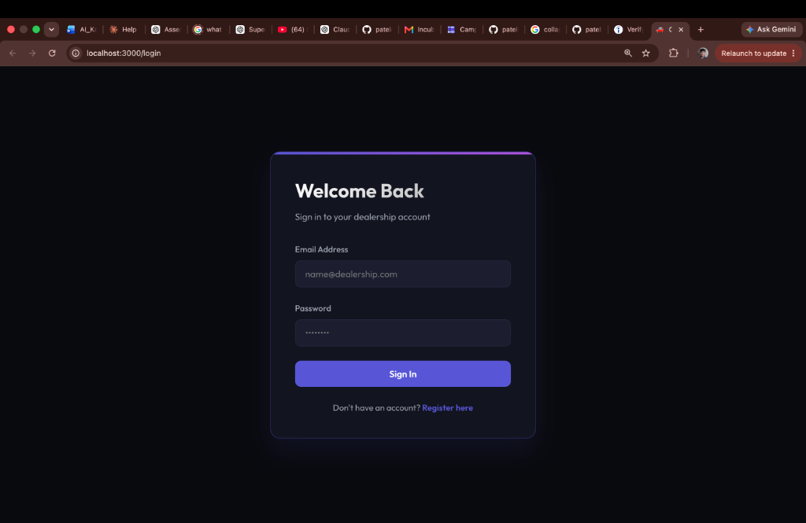
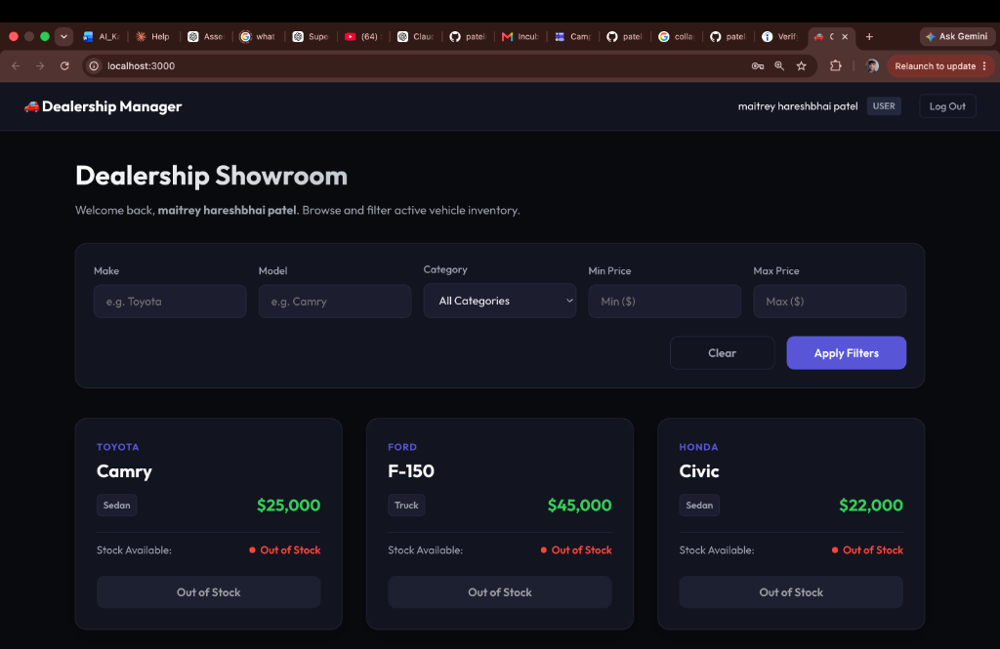
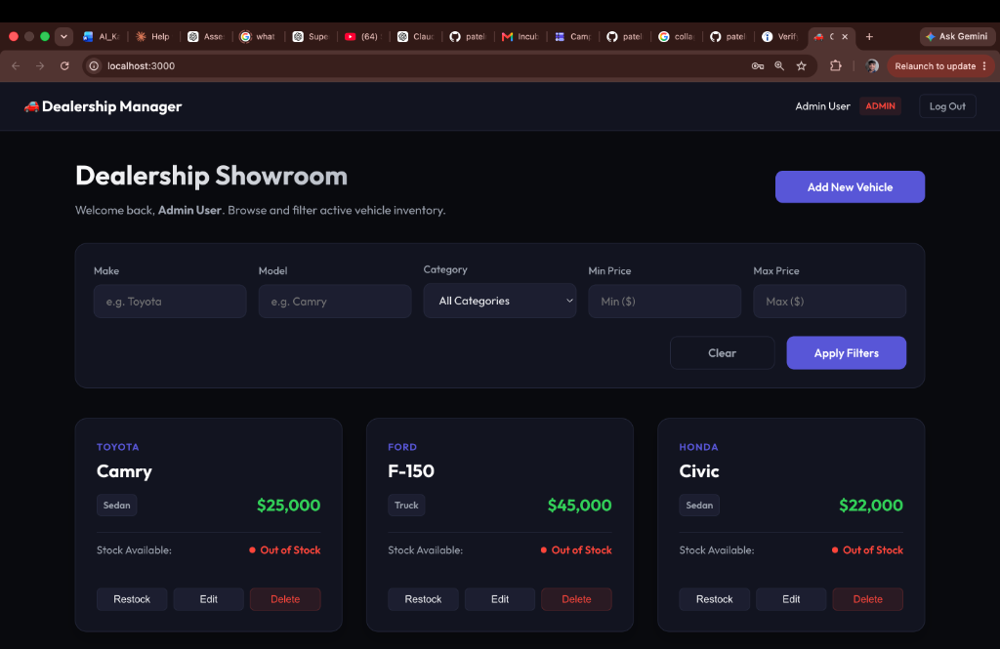
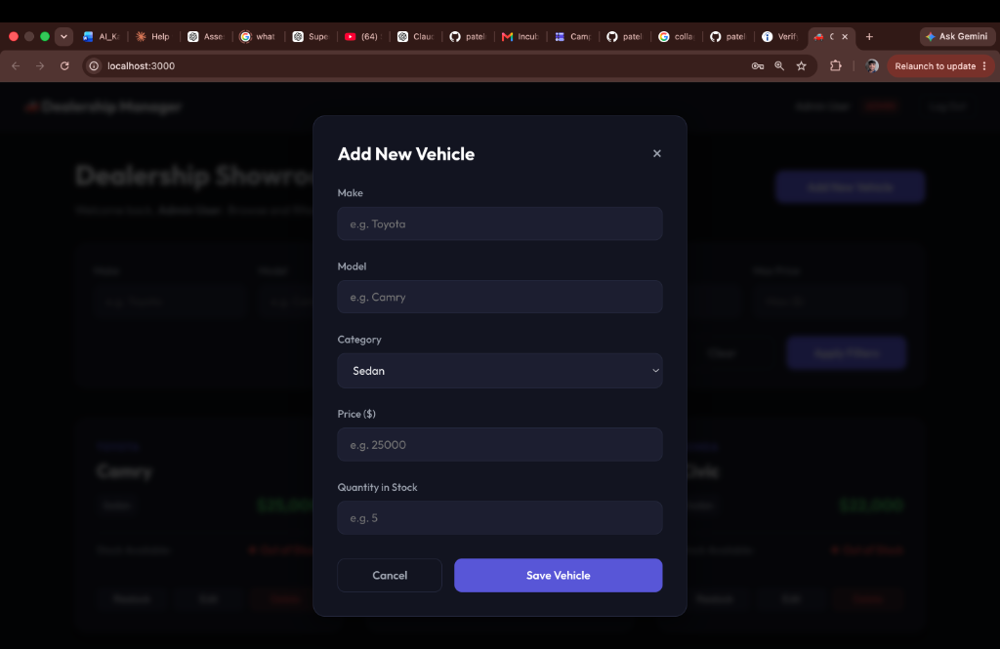

# AutoFlow — Car Dealership Inventory System

AutoFlow is a full-stack, responsive web application for managing vehicle showrooms, search operations, purchases, and admin restocking workflows. Built using Node.js, TypeScript, Express, MongoDB, and React (Vite), it showcases secure, role-based user management alongside robust concurrency-safe transactions.

---

## 1. Project Overview
AutoFlow serves as a digital showroom for a luxury car dealership. It facilitates two distinct types of user interactions:
- **Customers (Normal Users):** Can browse active listings, filter items by make, model, category, and price range, and purchase vehicles.
- **Dealership Administrators (Admin Users):** Can manage the showroom inventory by adding, updating, restocking, or deleting vehicle records.

---

## 2. Features

### Customer Experience (User Role)
- **Interactive Showroom Grid:** View luxury cars with dynamic stock indicators.
- **Search & Filters:** Combine make, model, category, and price boundary queries.
- **Instant Purchase Flow:** Click to buy vehicles instantly with loading states. The button disables automatically when stock hits zero.
- **JWT Session Persistence:** Automatic session logins via locally persisted secure JWT tokens.

### Administrative Panel (Admin Role)
- **Administrative Action Controls:** Add vehicles, edit pricing and characteristics, restock counts, and delete cars.
- **Quantity Restock Dialog:** Specify and add positive integer values to current inventory.
- **Client Role-Based Gating:** Hides all admin options (Add, Edit, Restock, Delete) from normal user views.

### System Integrity
- **Database Safety Guard:** Test suite blocks mutations if the test database URI matches the development database.
- **Atomic Concurrency Protection:** Purchase requests run atomic Mongoose queries to prevent over-purchasing race conditions.

---

## 3. Tech Stack

- **Monorepo Manager:** npm Workspaces
- **Backend:** Node.js, TypeScript, Express, Mongoose, MongoDB
- **Frontend:** React (SPA), TypeScript, Vite, Vanilla CSS
- **Testing Suite:** Vitest, Supertest, React Testing Library
- **Authentication:** JSON Web Tokens (JWT), `bcryptjs` password hashing

---

## 4. Folder Structure

```
assessment/
├── README.md                          # Main project documentation
├── TEST_REPORT.md                     # Complete test execution logs
├── package.json                       # Monorepo workspaces settings
├── docs/
│   ├── screenshots/                   # Application screenshots
│   └── superpowers/plans/             # Implementation plan logs
└── packages/
    ├── backend/                       # Node.js + Express + TypeScript Backend
    │   ├── src/
    │   │   ├── config/                # DB configurations
    │   │   ├── controllers/           # API handlers
    │   │   ├── middleware/            # JWT auth & route guards
    │   │   ├── models/                # MongoDB (Mongoose) schemas
    │   │   ├── routes/                # Express routing definitions
    │   │   ├── scripts/               # Seeder scripts
    │   │   └── server.ts              # Express application entrypoint
    │   └── tests/                     # Backend test suites (83 tests)
    └── frontend/                      # React + TypeScript + Vite Frontend
        ├── src/
        │   ├── api/                   # Axios client integrations
        │   ├── components/            # Gated Modals (Add, Edit, Restock)
        │   ├── context/               # Auth (JWT) context providers
        │   ├── pages/                 # Pages (Login, Register, Dashboard)
        │   ├── types/                 # TypeScript interfaces
        │   ├── App.tsx                # Main SPA router wrapper
        │   └── index.css              # Custom dark-mode styling variables
        └── App.test.tsx               # Frontend integration test suites (18 tests)
```

---

## 5. Environment Variables

Create a `.env` file in the `packages/backend/` directory:
```bash
# packages/backend/.env
MONGODB_URI=mongodb://localhost:27017/car-dealership
MONGODB_TEST_URI=mongodb://localhost:27017/car-dealership-test
JWT_SECRET=localdevsecretkeyfordealership
PORT=5001

# Default Admin Seed Credentials
ADMIN_NAME="Admin User"
ADMIN_EMAIL="admin@dealership.com"
ADMIN_PASSWORD="adminpassword123"
```

---

## 6. Setup & Installation

### Prerequisites
- Node.js (`v20.x` or higher)
- MongoDB Community Server running locally on the default port `27017`

### Step 1: Install Dependencies
From the repository root, run:
```bash
npm install
```

### Step 2: Seed Default Admin Credentials
To seed the default administrator account into your development database, run:
```bash
npm run seed:admin
```
- **Username:** `admin@dealership.com`
- **Password:** `adminpassword123`

### Step 3: Run the Showroom Application
Start both frontend and backend development servers concurrently:
```bash
npm run dev
```
- **Vite Frontend Server:** [http://localhost:3000](http://localhost:3000)
- **Express Backend Server:** [http://localhost:5001](http://localhost:5001)

---

## 7. API Overview

| Method | Endpoint | Description | Protected | Roles |
| :--- | :--- | :--- | :--- | :--- |
| `POST` | `/api/auth/register` | Register a new user | No | Anyone |
| `POST` | `/api/auth/login` | Login user and sign JWT | No | Anyone |
| `GET` | `/api/vehicles` | List all available vehicles | Yes | Normal / Admin |
| `GET` | `/api/vehicles/search`| Search/filter inventory items | Yes | Normal / Admin |
| `POST` | `/api/vehicles` | Add a new vehicle item | Yes | Admin only |
| `PUT` | `/api/vehicles/:id` | Update vehicle parameters | Yes | Admin only |
| `DELETE`| `/api/vehicles/:id` | Delete vehicle listing | Yes | Admin only |
| `POST` | `/api/vehicles/:id/purchase` | Purchase vehicle (stock -1) | Yes | Normal / Admin |
| `POST` | `/api/vehicles/:id/restock` | Restock vehicle (stock +qty) | Yes | Admin only |

---

## 8. Testing Instructions

### Run Backend Tests (83 cases)
```bash
npm run test --workspace=backend
```

### Run Frontend Tests (18 cases)
```bash
npm run test --workspace=frontend
```

---

## 9. UI Screenshots

### Login Page


### User Vehicle Dashboard


### Admin Vehicle Management Dashboard


### Add Vehicle Modal Form


---

## 10. My AI Usage

### AI Tools Utilized
- **Antigravity (Google DeepMind):** Used as the primary pair-programming agent for codebase refactoring, backend schema bounds verification, and frontend modal styling.
- **Gemini:** Used for structural planning and route path mapping during the architecture stage.

### How They Were Used
- **TDD Verification:** Asked Antigravity to write unit tests for backend controllers first, verifying validation edge cases (negative pricing, negative stock increments) before writing green code.
- **Concurrency QA:** The assistant checked that purchasing updates were fully database-atomic to prevent race conditions.
- **JSDOM PopState Fix:** Handled JSDOM history state synchronization bugs using popstate event dispatchers.

### Reflection
Pair-programming with Antigravity speeded up boilerplate setup and automated directory audit tracking, allowing us to maintain a clean git commits trace with clear RED-GREEN steps and co-author tags.

---

## 11. Future Improvements
- Implement paginated API returns on vehicle GET listings to optimize large inventories.
- Configure automatic GitHub Actions CI workflow to run Vitest suites on commits.
