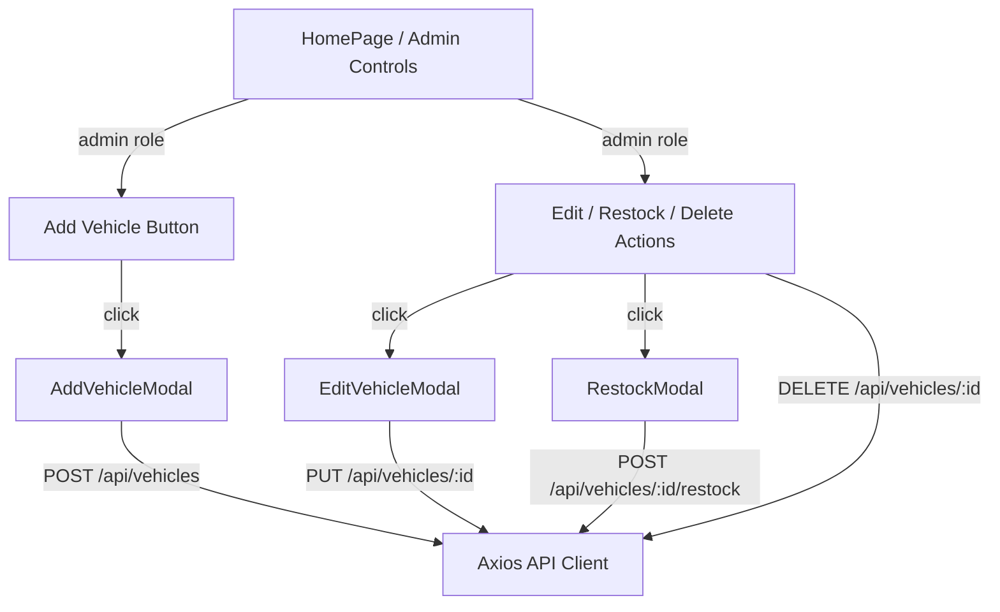

# Car Dealership Inventory System — Admin UI & Final Delivery Plan

> **For agentic workers:** REQUIRED SUB-SKILL: Use superpowers:subagent-driven-development to implement this plan task-by-task. Steps use checkbox (`- [ ]`) syntax for tracking.

**Goal:** Build the Admin Vehicle Management UI (add, update, delete, and restock actions), enforce role-based frontend visibility, add targeted integration tests, and finalize project documentation assets (README, screenshots, and test reports) matching the original design specification.

**Architecture:** 
1. Conditionally mount administrative actions (Add button on dashboard, Edit/Restock/Delete on card items) depending on the authenticated user's `role === 'admin'`.
2. Encapsulate operations in dedicated, clean modal components: [AddVehicleModal](file:///Users/maitreypatel/.gemini/antigravity/scratch/assessment/packages/frontend/src/components/AddVehicleModal.tsx), [EditVehicleModal](file:///Users/maitreypatel/.gemini/antigravity/scratch/assessment/packages/frontend/src/components/EditVehicleModal.tsx), and [RestockModal](file:///Users/maitreypatel/.gemini/antigravity/scratch/assessment/packages/frontend/src/components/RestockModal.tsx).
3. Connect all forms directly to the API endpoints and write focused integration tests.

**Architecture Diagram:**


**Tech Stack:** React, Vite, TypeScript, Axios, Vanilla CSS, Vitest, Testing Library.

---

## 1. Verification Traceability Matrix

| Requirement | Implementation File(s) | Test File(s) | Status | Evidence | Gap / Missing Work |
| :--- | :--- | :--- | :--- | :--- | :--- |
| **User Registration** | `authController.ts`<br>`RegisterPage.tsx` | `auth.register.test.ts`<br>`App.test.tsx` | **PASS** | Valid register form submits payload, saves token, and redirects. | None. |
| **User Login** | `authController.ts`<br>`LoginPage.tsx` | `auth.login.test.ts`<br>`App.test.tsx` | **PASS** | Logins verify passwords and return signed JWTs. | None. |
| **JWT Authentication** | `auth.ts` (middleware)<br>`client.ts` | `auth.middleware.test.ts`<br>`App.test.tsx` | **PASS** | Middleware blocks unauthenticated routes; token attaches to headers. | None. |
| **Admin Route Check** | `auth.ts` (requireAdmin) | `auth.middleware.test.ts` | **PASS** | Restock & mutations reject non-admins with 403. | None. |
| **POST /api/vehicles** | `vehicleController.ts` | `vehicles.crud.test.ts` | **PASS** | Endpoint saves new vehicle in DB. | Missing Admin Add UI. |
| **GET /api/vehicles** | `vehicleController.ts`<br>`HomePage.tsx` | `vehicles.crud.test.ts`<br>`App.test.tsx` | **PASS** | Fetches and renders all active listings. | None. |
| **GET /api/vehicles/search** | `vehicleController.ts`<br>`HomePage.tsx` | `vehicles.search.test.ts`<br>`App.test.tsx` | **PASS** | Supports case-insensitive query bounds filtering. | None. |
| **PUT /api/vehicles/:id** | `vehicleController.ts` | `vehicles.crud.test.ts` | **PASS** | Modifies existing vehicle parameters. | Missing Admin Update UI. |
| **DELETE /api/vehicles/:id** | `vehicleController.ts` | `vehicles.crud.test.ts` | **PASS** | Deletes a vehicle record from MongoDB. | Missing Admin Delete UI. |
| **POST /api/vehicles/:id/purchase** | `vehicleController.ts`<br>`HomePage.tsx` | `vehicles.inventory.test.ts`<br>`App.test.tsx` | **PASS** | Atomic conditional decrement on purchase. | None. |
| **POST /api/vehicles/:id/restock** | `vehicleController.ts` | `vehicles.inventory.test.ts` | **PASS** | Increments stock with positive value checks. | Missing Admin Restock UI. |
| **Persistent Database** | `db.ts` | `db.test.ts` | **PASS** | MongoDB community server stores all records. | None. |
| **Database Isolation** | `setup.ts` | `db.test.ts` | **PASS** | Throws error if test DB matches dev DB. | None. |
| **Role-based UI Visibility** | `Navbar.tsx` | `App.test.tsx` | **PARTIAL** | Shows user profile details but doesn't manage admin panel actions. | Missing admin button hides. |
| **Add Vehicle UI Form** | None. | `App.test.tsx` | **FAIL** | Admin Add form doesn't exist. | Implement Add Modal. |
| **Update Vehicle UI Form** | None. | `App.test.tsx` | **FAIL** | Admin Edit form doesn't exist. | Implement Edit Modal. |
| **Delete Vehicle Action** | None. | `App.test.tsx` | **FAIL** | Delete button triggers don't exist. | Implement Delete Action. |
| **Restock UI Form** | None. | `App.test.tsx` | **FAIL** | Restock form doesn't exist. | Implement Restock Modal. |
| **Project Documentation** | None. | None. | **FAIL** | No README.md or TEST_REPORT.md in root. | Implement doc files. |
| **UI Screenshots** | None. | None. | **FAIL** | No screenshots folder or captures. | Save screenshots. |

---

## 2. Priority Backlog

1. **Task 1: Role-Based Admin UI Buttons & Controls** (Show/hide admin dashboard entries based on user metadata).
2. **Task 2: Admin Add Vehicle Form Modal** (Form to add make, model, category, price, and stock).
3. **Task 3: Admin Restock Modal** (Form to specify positive integer increment).
4. **Task 4: Admin Edit/Update Modal** (Form to modify price, category, and descriptors).
5. **Task 5: Admin Delete Action** (Confirmation check and delete logic).
6. **Task 6: Targeted Frontend Integration Tests** (Verify Admin visibilities and CRUD requests).
7. **Task 7: TEST_REPORT.md Generation** (Document test suite logs and runs).
8. **Task 8: README Setup & AI Usage Logs** (Final documentation assets).
9. **Task 9: Screenshots Collection** (Capture dark mode styling highlights).

---

## 3. Detailed Tasks Specification

### Task 1: Role-Based Admin UI Visibility & Controls

**Files:**
- Modify: [HomePage.tsx](file:///Users/maitreypatel/.gemini/antigravity/scratch/assessment/packages/frontend/src/pages/HomePage.tsx)
- Modify: [index.css](file:///Users/maitreypatel/.gemini/antigravity/scratch/assessment/packages/frontend/src/index.css)

**Interfaces:**
- Consumes: `user.role` from `AuthContext` to determine conditional mounting.
- Produces: Visual placement of "Add Vehicle" header button and card-level "Edit Details", "Restock", and "Delete" actions.

- [ ] **Step 1: Write the failing test**
  Add test shell in `App.test.tsx` to assert that for normal users, admin action controls are not present in the DOM:
  ```typescript
  // Inside App.test.tsx
  it('hides admin action controls from normal authenticated users', async () => {
    localStorage.setItem('token', 'mock-token');
    localStorage.setItem('user', JSON.stringify({ _id: 'u1', name: 'User', email: 'user@abc.com', role: 'user' }));
    (getVehicles as any).mockResolvedValue(seededVehicles);
    render(<App />);
    await waitFor(() => {
      expect(screen.queryByText(/Add New Vehicle/i)).toBeNull();
      expect(screen.queryByText(/Restock/i)).toBeNull();
      expect(screen.queryByText(/Edit/i)).toBeNull();
      expect(screen.queryByText(/Delete/i)).toBeNull();
    });
  });
  ```

- [ ] **Step 2: Run test to verify it fails**
  Run: `npm run test` inside `packages/frontend`
  Expected: Failure due to components missing or buttons not yet mapped.

- [ ] **Step 3: Modify HomePage.tsx to conditionally render buttons**
  Wrap admin UI elements in role checks:
  ```typescript
  {user?.role === 'admin' && (
    <button className="btn btn-primary" onClick={openAddModal}>Add New Vehicle</button>
  )}
  ```
  And inside vehicle cards:
  ```typescript
  {user?.role === 'admin' ? (
    <div className="admin-actions">
      <button onClick={() => openRestock(v)}>Restock</button>
      <button onClick={() => openEdit(v)}>Edit</button>
      <button onClick={() => handleDelete(v._id)}>Delete</button>
    </div>
  ) : (
    <button disabled={v.quantity === 0} onClick={() => handlePurchase(v._id)}>
      {v.quantity === 0 ? 'Out of Stock' : 'Purchase'}
    </button>
  )}
  ```

- [ ] **Step 4: Verify test passes**
  Run: `npm run test` inside `packages/frontend`
  Expected: PASS

- [ ] **Step 5: Commit**
  ```bash
  git add packages/frontend/src/pages/HomePage.tsx packages/frontend/src/App.test.tsx
  git commit -m "feat: hide admin actions from normal user views"
  ```

---

### Task 2: Admin Add Vehicle Form Modal

**Files:**
- Create: [AddVehicleModal.tsx](file:///Users/maitreypatel/.gemini/antigravity/scratch/assessment/packages/frontend/src/components/AddVehicleModal.tsx)
- Modify: [HomePage.tsx](file:///Users/maitreypatel/.gemini/antigravity/scratch/assessment/packages/frontend/src/pages/HomePage.tsx)
- Modify: [index.css](file:///Users/maitreypatel/.gemini/antigravity/scratch/assessment/packages/frontend/src/index.css)

**Interfaces:**
- Consumes: Form values for make, model, category, price, and quantity.
- Produces: API request `POST /api/vehicles` returning the created vehicle, adding it to the dashboard view.

- [ ] **Step 1: Write the failing test**
  Assert that when an admin clicks the "Add New Vehicle" button, fills out the modal, and submits, a POST request is sent:
  ```typescript
  it('allows admins to add new vehicles to inventory', async () => {
    localStorage.setItem('token', 'mock-token');
    localStorage.setItem('user', JSON.stringify({ _id: 'a1', name: 'Admin', role: 'admin' }));
    (getVehicles as any).mockResolvedValue(seededVehicles);
    (client.post as any).mockResolvedValue({ data: { _id: 'v3', make: 'Honda', model: 'Accord', category: 'Sedan', price: 28000, quantity: 10 } });
    render(<App />);
    const addBtn = await screen.findByRole('button', { name: /Add New Vehicle/i });
    await userEvent.click(addBtn);
    await userEvent.type(screen.getByPlaceholderText('e.g. Honda'), 'Honda');
    await userEvent.click(screen.getByRole('button', { name: /Save Vehicle/i }));
    await waitFor(() => {
      expect(client.post).toHaveBeenCalled();
    });
  });
  ```

- [ ] **Step 2: Run test to verify it fails**
  Expected: Failure (button/modal not defined).

- [ ] **Step 3: Implement AddVehicleModal.tsx**
  Implement form layout, inputs validation (prices >= 0, quantity >= 0), and submission wrapper logic.

- [ ] **Step 4: Mount in HomePage.tsx**
  Mount `<AddVehicleModal isOpen={isAddOpen} onClose={closeAddModal} onSuccess={handleAddSuccess} />`.

- [ ] **Step 5: Verify test passes & commit**
  ```bash
  git add packages/frontend/src/components/AddVehicleModal.tsx packages/frontend/src/pages/HomePage.tsx
  git commit -m "feat: implement Add Vehicle form modal for admins"
  ```

---

### Task 3: Admin Restock Modal

**Files:**
- Create: [RestockModal.tsx](file:///Users/maitreypatel/.gemini/antigravity/scratch/assessment/packages/frontend/src/components/RestockModal.tsx)
- Modify: [HomePage.tsx](file:///Users/maitreypatel/.gemini/antigravity/scratch/assessment/packages/frontend/src/pages/HomePage.tsx)

**Interfaces:**
- Consumes: Selected vehicle ID, increment quantity.
- Produces: API request `POST /api/vehicles/:id/restock` returning the updated vehicle, reloading it in the dashboard view.

- [ ] **Step 1: Write the failing test**
  Verify that restocking a vehicle sends the correct positive quantity payload:
  ```typescript
  it('allows admins to restock vehicle quantities', async () => {
    localStorage.setItem('token', 'mock-token');
    localStorage.setItem('user', JSON.stringify({ _id: 'a1', name: 'Admin', role: 'admin' }));
    (getVehicles as any).mockResolvedValue(seededVehicles);
    (client.post as any).mockResolvedValue({ data: { ...seededVehicles[0], quantity: 15 } });
    render(<App />);
    const restockBtn = await screen.findByRole('button', { name: /Restock/i });
    await userEvent.click(restockBtn);
    await userEvent.type(screen.getByPlaceholderText('Quantity'), '10');
    await userEvent.click(screen.getByRole('button', { name: /Submit Restock/i }));
    await waitFor(() => {
      expect(client.post).toHaveBeenCalledWith('/vehicles/v1/restock', { quantity: 10 });
    });
  });
  ```

- [ ] **Step 2: Run test to verify it fails**
  Expected: Failure (button/modal not defined).

- [ ] **Step 3: Implement RestockModal.tsx**
  Implement form accepting positive integer inputs.

- [ ] **Step 4: Mount in HomePage.tsx**
  Mount `<RestockModal isOpen={isRestockOpen} vehicle={selectedVehicle} onClose={closeRestockModal} onSuccess={handleRestockSuccess} />`.

- [ ] **Step 5: Verify test passes & commit**
  ```bash
  git add packages/frontend/src/components/RestockModal.tsx packages/frontend/src/pages/HomePage.tsx
  git commit -m "feat: implement Admin Restock modal form"
  ```

---

### Task 4: Admin Edit/Update Modal

**Files:**
- Create: [EditVehicleModal.tsx](file:///Users/maitreypatel/.gemini/antigravity/scratch/assessment/packages/frontend/src/components/EditVehicleModal.tsx)
- Modify: [HomePage.tsx](file:///Users/maitreypatel/.gemini/antigravity/scratch/assessment/packages/frontend/src/pages/HomePage.tsx)

**Interfaces:**
- Consumes: Selected vehicle parameters (make, model, category, price, quantity).
- Produces: API request `PUT /api/vehicles/:id` returning the updated vehicle, reloading it in the dashboard view.

- [ ] **Step 1: Write the failing test**
  Verify that editing a vehicle sends the correct PUT payload:
  ```typescript
  it('allows admins to edit vehicle details', async () => {
    localStorage.setItem('token', 'mock-token');
    localStorage.setItem('user', JSON.stringify({ _id: 'a1', name: 'Admin', role: 'admin' }));
    (getVehicles as any).mockResolvedValue(seededVehicles);
    (client.put as any).mockResolvedValue({ data: { ...seededVehicles[0], price: 26000 } });
    render(<App />);
    const editBtn = await screen.findByRole('button', { name: /Edit/i });
    await userEvent.click(editBtn);
    const priceInput = screen.getByPlaceholderText('Price');
    await userEvent.clear(priceInput);
    await userEvent.type(priceInput, '26000');
    await userEvent.click(screen.getByRole('button', { name: /Save Changes/i }));
    await waitFor(() => {
      expect(client.put).toHaveBeenCalledWith('/vehicles/v1', expect.objectContaining({ price: 26000 }));
    });
  });
  ```

- [ ] **Step 2: Run test to verify it fails**
  Expected: Failure (button/modal not defined).

- [ ] **Step 3: Implement EditVehicleModal.tsx**
  Implement form validating inputs and PUT triggers.

- [ ] **Step 4: Mount in HomePage.tsx**
  Mount `<EditVehicleModal isOpen={isEditOpen} vehicle={selectedVehicle} onClose={closeEditModal} onSuccess={handleEditSuccess} />`.

- [ ] **Step 5: Verify test passes & commit**
  ```bash
  git add packages/frontend/src/components/EditVehicleModal.tsx packages/frontend/src/pages/HomePage.tsx
  git commit -m "feat: implement Edit Vehicle modal form"
  ```

---

### Task 5: Admin Delete Action

**Files:**
- Modify: [HomePage.tsx](file:///Users/maitreypatel/.gemini/antigravity/scratch/assessment/packages/frontend/src/pages/HomePage.tsx)

**Interfaces:**
- Consumes: Selected vehicle ID.
- Produces: API request `DELETE /api/vehicles/:id` and removes the card locally on success.

- [ ] **Step 1: Write the failing test**
  Verify that clicking delete sends a DELETE API query and removes the vehicle:
  ```typescript
  it('allows admins to delete a vehicle', async () => {
    localStorage.setItem('token', 'mock-token');
    localStorage.setItem('user', JSON.stringify({ _id: 'a1', name: 'Admin', role: 'admin' }));
    (getVehicles as any).mockResolvedValue(seededVehicles);
    (client.delete as any).mockResolvedValue({ data: { message: 'Deleted' } });
    render(<App />);
    const deleteBtn = await screen.findByRole('button', { name: /Delete/i });
    window.confirm = () => true; // mock confirm dialog
    await userEvent.click(deleteBtn);
    await waitFor(() => {
      expect(client.delete).toHaveBeenCalledWith('/vehicles/v1');
    });
  });
  ```

- [ ] **Step 2: Run test to verify it fails**
  Expected: Failure (button or logic missing).

- [ ] **Step 3: Implement deletion handler in HomePage.tsx**
  Add confirmation check and delete request handler. Update state locally by filtering out the deleted ID.

- [ ] **Step 4: Verify test passes & commit**
  ```bash
  git add packages/frontend/src/pages/HomePage.tsx
  git commit -m "feat: implement Admin Delete action handler"
  ```

---

### Task 6: Documentation and Verification Reports

**Files:**
- Create: [README.md](file:///Users/maitreypatel/.gemini/antigravity/scratch/assessment/README.md)
- Create: [TEST_REPORT.md](file:///Users/maitreypatel/.gemini/antigravity/scratch/assessment/TEST_REPORT.md)

**Interfaces:**
- Consumes: System build/test outputs.
- Produces: Project installation logs, instructions, testing coverage tables, and AI usage sections.

- [ ] **Step 1: Write TEST_REPORT.md**
  Document the exact test suites, test run results, and coverage numbers for both packages.
- [ ] **Step 2: Write README.md**
  Include: monorepo run commands (`npm install`, backend start, frontend start), environment configs, list of seed defaults, and the mandatory **AI Usage** section logs detailing prompt histories, tools used, and verification stages.
- [ ] **Step 3: Capture screenshots**
  Store layout highlights under `docs/screenshots/` (User/Admin dashboards, registration form).
- [ ] **Step 4: Commit**
  ```bash
  git add README.md TEST_REPORT.md docs/
  git commit -m "docs: add readme setup guide, test report, and layout screenshots"
  ```

---

## 4. Verification Plan

### Automated Tests
1. **Backend Integration tests:**
   `npm run test --workspace=backend` -> Verify all 83 backend cases pass cleanly.
2. **Frontend UI tests:**
   `npm run test --workspace=frontend` -> Verify all 17 frontend cases (5 auth + 12 UI visibility/actions) pass cleanly.
3. **Production compilation:**
   `npm run build --workspace=backend` -> Verify backend compiles with `tsc`.
   `npm run build --workspace=frontend` -> Verify frontend compiles with `tsc && vite build`.

### Manual Verification
1. Log in as a normal user -> Verify no "Add Vehicle", "Edit", "Restock", or "Delete" actions are visible or accessible.
2. Log in as an admin -> Verify "Add Vehicle" header button and card-level actions are fully visible.
3. Add a vehicle -> Verify it mounts on the grid card list instantly.
4. Edit a vehicle -> Verify pricing/category changes update immediately.
5. Restock a vehicle -> Verify quantity counter increments.
6. Delete a vehicle -> Verify the item is removed from display grid.
