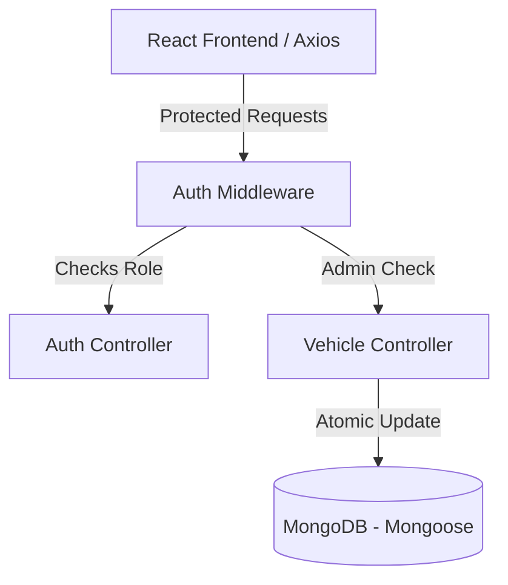

# Design Spec: Car Dealership Inventory System (TDD Kata)

**Date**: 2026-07-12  
**Status**: Draft (Awaiting User Review)

---

## 1. Complete Requirements Analysis

We are building a full-stack Car Dealership Inventory System that strictly follows Test-Driven Development (TDD) for the backend.

### Backend Requirements:
*   **Authentication**:
    *   `POST /api/auth/register` (New user registration).
    *   `POST /api/auth/login` (Authentication, returns JWT).
    *   Protected endpoints must verify the `Authorization: Bearer <token>` header.
*   **Vehicles CRUD (All Protected)**:
    *   `POST /api/vehicles` (Add new vehicle - Protected, Admin only).
    *   `GET /api/vehicles` (View all vehicles - Protected, Authenticated users).
    *   `GET /api/vehicles/search` (Search vehicles - Protected, Authenticated users).
    *   `PUT /api/vehicles/:id` (Update vehicle - Protected, Admin only).
    *   `DELETE /api/vehicles/:id` (Delete vehicle - Protected, Admin only).
*   **Inventory Control (All Protected)**:
    *   `POST /api/vehicles/:id/purchase` (Purchase exactly 1 vehicle; quantity decreases by 1; fails if quantity is 0; Protected, Authenticated users).
    *   `POST /api/vehicles/:id/restock` (Increase quantity by specified positive amount; Protected, Admin only).

### Frontend Requirements:
*   Single-Page React + TypeScript app built with Vite.
*   User registration and login forms (with name field during registration).
*   Dashboard/homepage displaying available vehicles with search/filter panel (make, model, category, minPrice, maxPrice).
*   Purchase button on each vehicle (disabled when out of stock).
*   Admin-specific views/actions: Add Vehicle form/modal, Edit/Update Vehicle modal, Delete Vehicle action, Restock Modal.
*   Vanilla CSS styling with premium dark mode aesthetics.

---

## 2. Ambiguities & Recommended Decisions

| Ambiguity | Recommendation / Decision |
| :--- | :--- |
| **Is GET `/api/vehicles/:id` required?** | **No.** Invalid-ID and Not-Found behaviors will be tested directly against the required ID-based endpoints: PUT, DELETE, Purchase, and Restock. |
| **Standard Error Response Shape?** | Every error response will consistently return: `{ "message": "Human-readable error description" }`. |
| **Test Database Safety?** | Automated tests must connect to a separate test database. The test suite will verify `MONGODB_TEST_URI` is present and does not equal `MONGODB_URI` before executing database mutations. |
| **Frontend Targeted Tests?** | We will implement targeted frontend tests verifying: button disabled/enabled states based on stock levels, login redirection for protected routes, and visibility of admin controls. |

---

## 3. Simplest Complete Architecture

The project will be structured as a **Monorepo** consisting of two main sub-projects:
1.  **Backend**: Node.js, Express, TypeScript, Mongoose. Organized cleanly into controllers, models, routes, and middleware.
2.  **Frontend**: React, Vite, TypeScript, Vanilla CSS.



---

## 4. Recommended Project Directory Structure

```
assessment/
├── package.json                 # Monorepo configuration
├── README.md                    # Core documentation + AI usage log
├── TEST_REPORT.md               # Record of executed test results
├── .env.example                 # Template for environment variables
├── docs/
│   └── superpowers/specs/       # Brainstorming Design specs
└── packages/
    ├── backend/
    │   ├── package.json
    │   ├── tsconfig.json
    │   ├── src/
    │   │   ├── config/          # DB connection, env variables
    │   │   ├── controllers/     # Controller request handlers
    │   │   ├── middleware/      # Auth & Admin validation
    │   │   ├── models/          # Mongoose User and Vehicle Models
    │   │   ├── routes/          # Express Routers
    │   │   ├── scripts/         # Admin seeding script
    │   │   ├── app.ts           # Express App setup
    │   │   └── server.ts        # Listen on port
    │   └── tests/               # Vitest + Supertest integration tests
    └── frontend/
        ├── package.json
        ├── tsconfig.json
        ├── index.html
        ├── src/
        │   ├── components/      # UI Elements (VehicleCard, FilterBar, Modals)
        │   ├── contexts/        # AuthContext for JWT management
        │   ├── pages/           # Dashboard, Login, Register
        │   ├── services/        # Axios API clients
        │   ├── index.css        # Premium Vanilla CSS Design System
        │   └── main.tsx
```

---

## 5. Database Model Design

### User Model
```typescript
interface IUser {
  _id: string;
  name: string;          // Required display name
  email: string;         // Unique, lowercase, validated format
  passwordHash: string;  // bcrypt hashed password
  role: 'user' | 'admin';
  createdAt: Date;
  updatedAt: Date;
}
```

### Vehicle Model
```typescript
interface IVehicle {
  _id: string;
  make: string;          // e.g., 'Ford'
  model: string;         // e.g., 'Mustang'
  category: string;      // e.g., 'Coupe', 'SUV', 'Sedan'
  price: number;         // Positive number
  quantity: number;      // Integer >= 0
  createdAt: Date;
  updatedAt: Date;
}
```

---

## 6. Authentication & Authorization Flow

### Authentication Flow
1.  **Registration**: Client sends name, email, password. Server hashes password via `bcrypt` (10 rounds) and saves user with `role: "user"`.
2.  **Login**: Client sends credentials. Server compares passwords, signs a JWT containing `{ id: user._id, role: user.role }`, and returns it.
3.  **Client Storage**: Frontend stores JWT in `localStorage` and appends it to outgoing Axios requests via the `Authorization: Bearer <token>` header.

### Authorization Middleware
*   `authenticateUser`: Verifies the JWT. If invalid/expired, returns `401 Unauthorized` with `{ "message": "..." }`.
*   `requireAdmin`: Checks if `req.user.role === 'admin'`. If not, returns `403 Forbidden` with `{ "message": "..." }`.

---

## 7. API Contracts & Expected HTTP Status Codes

All errors consistently return the shape `{ "message": "error description" }`.

| Endpoint | Method | Role | Request Body | Success | Error Statuses |
| :--- | :--- | :--- | :--- | :--- | :--- |
| `/api/auth/register` | `POST` | Public | `{ name, email, password }` | `201 Created` | `400 Bad Request` |
| `/api/auth/login` | `POST` | Public | `{ email, password }` | `200 OK` | `401 Unauthorized` |
| `/api/vehicles` | `GET` | Authenticated | *None* | `200 OK` | `401 Unauthorized`, `500 Server Error` |
| `/api/vehicles` | `POST` | Admin | `{ make, model, category, price, quantity }` | `201 Created` | `400 Bad Request`, `401 Unauthorized`, `403 Forbidden` |
| `/api/vehicles/search`| `GET` | Authenticated | *Query Params* | `200 OK` | `401 Unauthorized`, `500 Server Error` |
| `/api/vehicles/:id` | `PUT` | Admin | `{ price, quantity, ... }` | `200 OK` | `400 Bad Request`, `401 Unauthorized`, `403 Forbidden`, `404 Not Found` |
| `/api/vehicles/:id` | `DELETE`| Admin | *None* | `200 OK` | `401 Unauthorized`, `403 Forbidden`, `404 Not Found` |
| `/api/vehicles/:id/purchase` | `POST` | Authenticated | *None* | `200 OK` | `400 Out of Stock`, `401 Unauthorized`, `404 Not Found` |
| `/api/vehicles/:id/restock` | `POST` | Admin | `{ quantity }` | `200 OK` | `400 Bad Request`, `401 Unauthorized`, `403 Forbidden`, `404 Not Found` |

---

## 8. Frontend Interface & Components

We will build a dynamic dark-mode interface styled with Premium Vanilla CSS (incorporating modern glassmorphism, glowing borders, and crisp typography).

### Pages
1.  **Authentication Page**: Toggle between Register (with name, email, password fields) and Login form cards.
2.  **Dashboard**: Main screen for searching, filtering, and purchasing vehicles. Includes the Admin management entry points if logged in as admin.

### Key Components
*   `Navbar`: Logo, active user info (display name), role badge, Admin panel toggle, and Sign Out button.
*   `SearchFilterPanel`: Text search input with dropdown filters for make, model, category, and minimum/maximum price inputs.
*   `VehicleCard`: Displays details (make, model, price, stock status). Features an interactive "Purchase" button (disabled if quantity is 0).
*   `AdminControls`: Modals or forms for **Adding a Vehicle**, **Updating details**, and **Restocking stock** (accepting a positive input).

---

## 9. Test-Driven Development (TDD) Strategy

All backend endpoints will be implemented using the strict **Red-Green-Refactor** pattern:
1.  **RED**: Write a failing test in the `/tests` folder. Stage and commit it. Run the test and record the actual observed error.
2.  **Commit RED**: Create a Git commit including the co-author format if AI is used.
3.  **GREEN**: Write the minimal implementation code to satisfy the test.
4.  **Confirm GREEN**: Execute tests to confirm success.
5.  **Refactor**: Clean up implementation or test code while keeping tests green.
6.  **Commit GREEN/REFACTOR**: Create a Git commit with co-author format.

---

## 10. Test Database Safety

*   We will use a separate Mongo database for testing (e.g., `car-dealership-test`).
*   The backend will dynamically load the database URL based on `NODE_ENV=test`.
*   The test environment helper will verify `MONGODB_TEST_URI` is present and does not equal `MONGODB_URI`. If this safety check fails, it will immediately exit/fail the test suite before any Mongoose queries run.

---

## 11. Security Considerations

*   **Passwords**: Safely hashed with `bcrypt`. Plain text passwords are never stored.
*   **JWT Integrity**: Secrets stored in `.env` and kept out of Git. Token validation checks expiration and signature.
*   **Admin Hardening**: Admin-only actions require the `requireAdmin` check to verify the database User model role, preventing token modification spoofing.
*   **MongoDB Injection**: Avoid executing dynamic raw queries. Mongoose sanitizes parameters automatically, but we will explicitly cast incoming inputs (e.g., price and quantity to Numbers, IDs to ObjectIds).

---

## 12. Technical Risks & Mitigations

*   **Concurrency Race Conditions on Purchase**:
    *   *Risk*: If two users purchase the same vehicle with `quantity: 1` at the exact same millisecond, both might read `quantity: 1` and allow the purchase, resulting in a stock of `-1`.
    *   *Mitigation*: We will use MongoDB's atomic update capability:
        ```typescript
        const vehicle = await Vehicle.findOneAndUpdate(
          { _id: vehicleId, quantity: { $gt: 0 } },
          { $inc: { quantity: -1 } },
          { new: true }
        );
        ```
        If `vehicle` returns `null`, it means the vehicle did not exist or was out of stock, safely rejecting the purchase.
*   **Test Database Pollution**:
    *   *Risk*: Leftover data from one test file breaks assertions in another.
    *   *Mitigation*: Implement database cleaning middleware hook (`beforeEach` or `afterEach` clearing collections).
